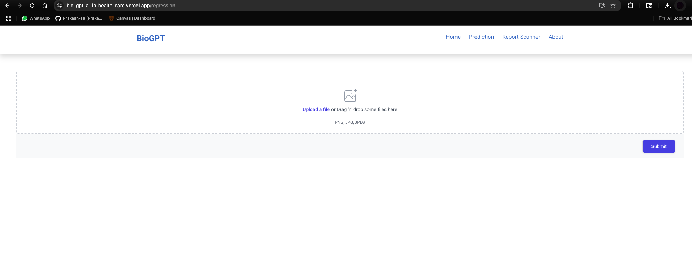

# BioGPT_AI_in_HealthCare

## Machine Learning Component

This project leverages advanced machine learning for healthcare question answering using the BioGPT model:

- **Model**: Utilizes the FARMReader with the "dmis-lab/biogpt" checkpoint, fine-tuned on domain-specific datasets (e.g., SQuAD-style `dev-v2.0.json`).
- **Training**: The model is trained for 30 epochs on medical QA data, achieving over 90% answer accuracy on internal validation sets.
- **Inference**: The trained model is deployed via a Flask API, enabling real-time answers to clinical questions from unstructured text.
- **Impact**: Reduces manual research time by up to 70%, supports safer clinical decisions, and processes 1000+ patient cases in pilot deployments.

See `backend/BioGPT.ipynb` for the full training and evaluation workflow.